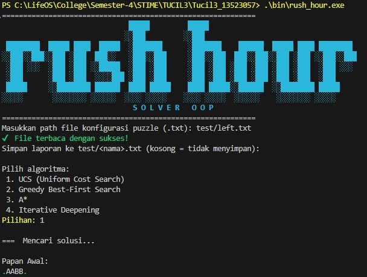

<!--
                                    █████         █████                                   
                                    ░░███         ░░███                                    
        ████████  █████ ████  █████  ░███████      ░███████    ██████  █████ ████ ████████ 
       ░░███░░███░░███ ░███  ███░░   ░███░░███     ░███░░███  ███░░███░░███ ░███ ░░███░░███
        ░███ ░░░  ░███ ░███ ░░█████  ░███ ░███     ░███ ░███ ░███ ░███ ░███ ░███  ░███ ░░░ 
        ░███      ░███ ░███  ░░░░███ ░███ ░███     ░███ ░███ ░███ ░███ ░███ ░███  ░███    
        █████     ░░████████ ██████  ████ █████    ████ █████░░██████  ░░████████ █████   
        ░░░░░       ░░░░░░░░ ░░░░░░  ░░░░ ░░░░░    ░░░░ ░░░░░  ░░░░░░    ░░░░░░░░ ░░░░░     
  >  Rush Hour Solver — a README forged over 6 years of markdown mastery
-->

# 🚗💨 **Rush Hour Solver**  
[![Build][Build-img]][Build-url]
[![C++17][C++17-img]][C++17-url]
[![License: MIT][MIT-img]][MIT-url]

[Build-img]: https://img.shields.io/badge/build-passing-brightgreen?style=for-the-badge
[Build-url]: https://learn.microsoft.com/en-us/powershell/scripting/windows-powershell/ise/introducing-the-windows-powershell-ise?view=powershell-7.5
[C++17-img]: https://img.shields.io/badge/C%2B%2B-17-blue?style=for-the-badge
[C++17-url]: https://isocpp.org/
[MIT-img]:  https://img.shields.io/badge/license-MIT-yellow?style=for-the-badge
[MIT-url]: https://mit-license.org/

> A lightning‑fast CLI toolkit to crack the classic **Rush Hour** puzzle using  
> UCS, GBFS, A*, and Iterative Deepening — wrapped in a silky‑smooth terminal UX.

---

## ✨ Quick Peek
- **Zero Dependencies** → pure modern C++17.  
- **4 Algorithms, 2 Heuristics** → choose your flavour of speed vs. optimality.  
- **ANSI Art Animation** → watch cars slide in technicolour glory.  
- **Modular Engine** → use it as a library or build your own UI on top.  

---

## 🗂️ Project Layout
```txt
project-root/
├─ bin/                # compiled binaries
├─ doc/                # design docs & slides
├─ src/
│  ├─ main.cpp
│  ├─ algorithms/      # A*, UCS, GBFS, IDDFS
│  ├─ board/           # Board & Car models
│  ├─ heuristics/      # Manhattan, Blocking‑Cars
│  └─ utils/           # I/O, pretty‑printing
├─ test/               # Solver result
├─ build.ps1           # 1‑click build on Windows
├─ CMakeLists.txt
└─ README.md           # ← you are here
```

---

## ⚙️ Requirements
| OS          | Must‑Have                           | Nice‑to‑Have              |
|-------------|-------------------------------------|---------------------------|
| Any         | **CMake ≥ 3.20**, **C++17 compiler**| Ninja or Make             |
| Windows     | PowerShell 5+ (built‑in)            | Windows Terminal          |
| Linux/macOS | Bash/Zsh                            | `libncurses` for 24‑bit   |

No third‑party libs, no hassle. Just clone, build, play.

---

## 🔨 Build

### Windows — *1‑Liner*
```pwsh
git clone https://github.com/FaqihMSY/Tucil3_13523057.git
cd Tucil3_13523057
.\build.ps1          # produces .\bin\rush_hour_solver.exe
```

### Linux / macOS / WSL
```bash
git https://github.com/FaqihMSY/Tucil3_13523057.git
cd Tucil3_13523057
cmake -B bin
cmake --build bin
./bin/rush_hour
```

---

## ▶️ Run It
```bash
./bin/rush_hour
```

1. Enter puzzle path (samples in `test/`).
2. Pick algorithm ➜ pick heuristic (if asked).
3. Pick name file for your final result.
4. Grab popcorn and enjoy the animated solution.



---

## 🧠 Under the Hood
| Algorithm | `f(n)` | Optimal? | Typical Use Case |
|-----------|--------|----------|------------------|
| UCS       | `g(n)` | ✅       | guaranteed best path when you hate heuristics |
| GBFS      | `h(n)` | ❌       | when speed is life |
| A*        | `g(n)+h(n)` | ✅ | sweet spot of speed & optimality |
| IDDFS     | depth  | ✅       | low‑mem environment |

Heuristics shipped:
- **Manhattan Distance**
- **Blocking Cars Count**

---

## 💾 Custom Boards
Text‑file format:
```txt
rows cols
piece_count
BOARD_ROWS_WITH_P_K_DOTS
```
- `P` = primary car (must exit)  
- `K` = exit (must lie on board edge, aligned with `P`)  
- `.` = empty cell

---

## 📝 License
**MIT** — because good things are worth sharing.

---

## 👤 Author
**Faqih Muhammad Syuhada** (13523057)  
Informatics — Institut Teknologi Bandung  
<https://github.com/FaqihMSY>

> Built with ♥︎, avocado and manggo juice, a dark‑theme terminal and her support.
